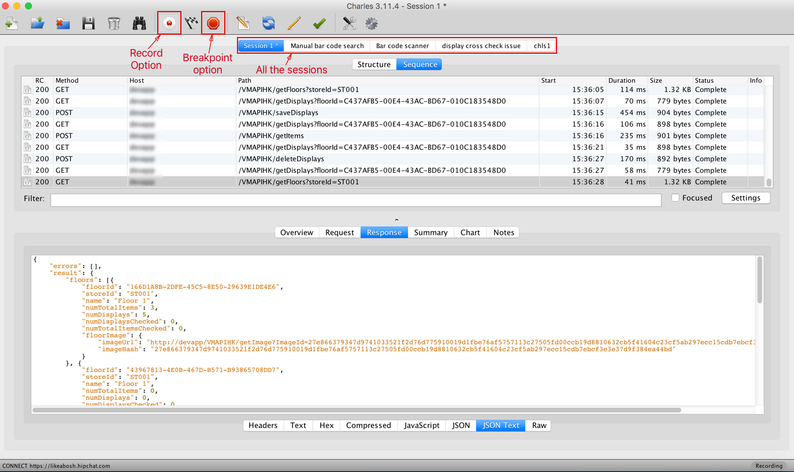
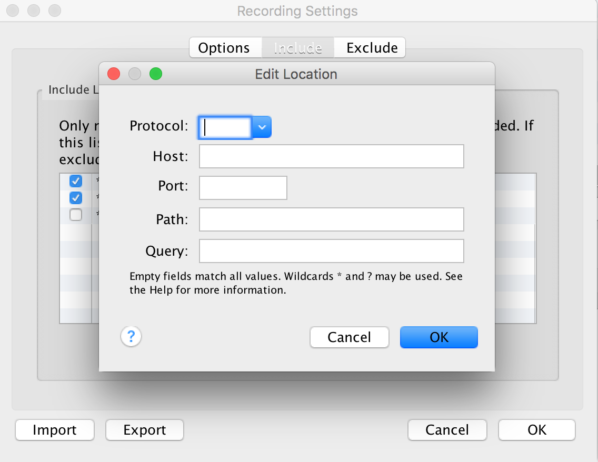
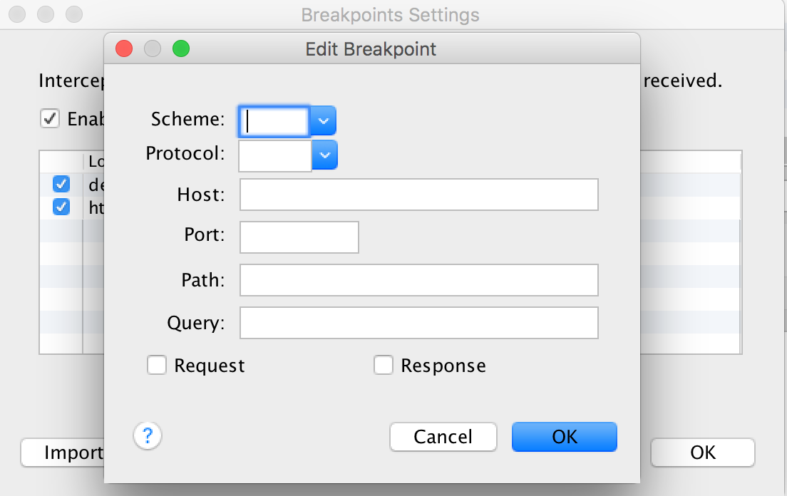
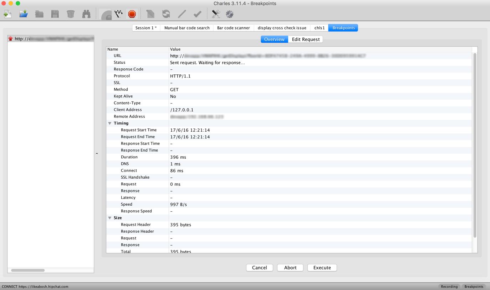
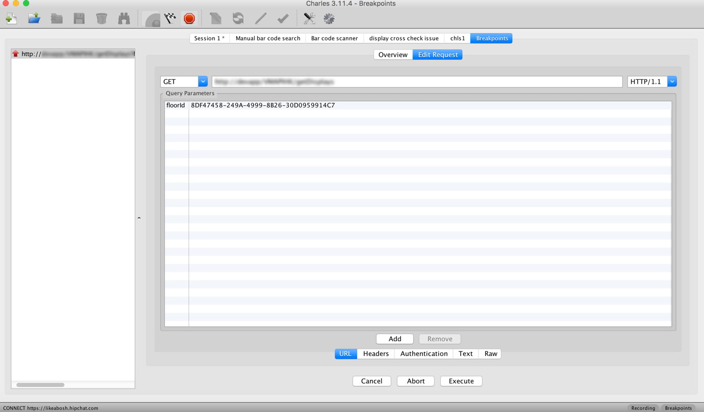
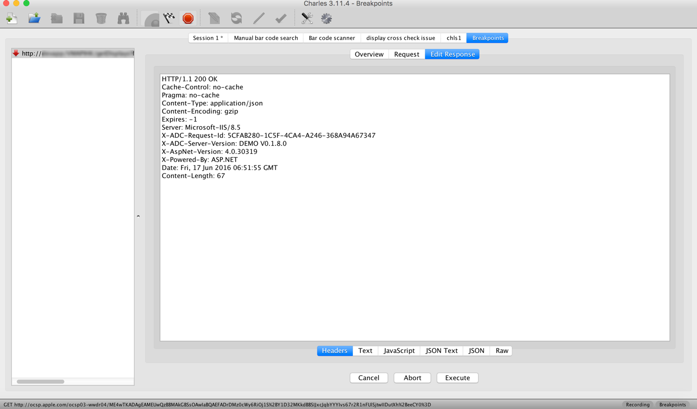
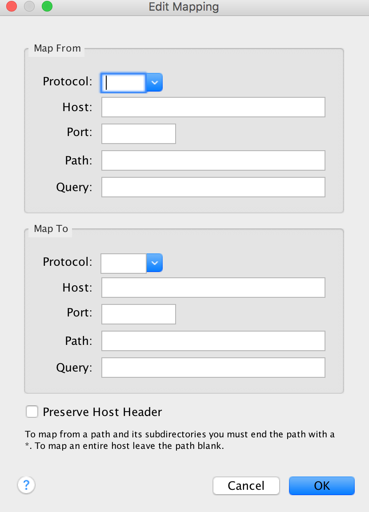

# Charles Proxy

Charles Proxy is an application, that is used for HTTP Proxy which lets you view and monitor every network requests and responses made from your system to the internet.

This tool is very helpful in debugging of network bugs, which are hard to detect and sometimes intermittent. These type of bugs are very hard to catch hold of and to detect the reason causing them, without tools such as Charles. Charles is a very handy, easy to use and learn tool that can be downloaded from [Charles main website](http://www.charlesproxy.com).  

Once downloaded and installed, open Charles and it'll prompt you to grant permission to auto configure the proxy settings, which should be granted unless you can configure it manually correctly, but configuring manually is annoying because you have to configure and reconfigure every time you start and stop Charles.  

Once configured, you'll be shown the main interface screen as seen in the below image.

  

The main interface could be divided into mainly four parts horizontally,

 * The top tool bar:  
 The top tool bar consist of buttons, like start a new session, open a session, close the current session and so on.

 * The request detail area:  
 This area consists of every request that are being recorded, with every information about that particular request such as response code, method, host identifier and so on. You can choose what to see here, by right clicking on the column heading.  
 There is a filter text field area, where you can enter any text pertaining to request(for example, see the requests for a particular path) and the requests that are shown will be filtered to ones that contain the text.  

 * The response detail area:  
 This area has the response details, including the headers and various rendering of the response, which can be selected as in text, javaScript, JSON, like so. We can select the details of the whole request-response cycle by clicking overview. If you just want details particular to request or response, you can click on the respective tab to view it.  

 * The bottom bar:  
 This bar will give the information of all the requests that are happening at that moment at it's left corner, and will show the settings that are enabled for the session, in it's right corner. For example, from the above image you can see that for this session, recording is active.  

**Recording**  

In Charles, on the top tool bar we can see the recording button, which should be selected for Charles to record and monitor the network activity of the system.  

By default, Charles will show every network activity that is happening through the proxy, but if you want to record only requests pertaining to few sources, you can change the recording settings. For this click on "Proxy -> Recording Settings...", from the main tool bar on top.  

This is very helpful when debugging, as we won't be distracted and disturbed by every new activity that pops up on the list, when we are investigating a request.

This will open the recording settings, which has three tabs:  
 * Options: This has recording limits that can be edited.  

 * Include: This tab has option to add a host and path address, so that Charles will record network activity with respect to only the given values, when they are selected. If they are not selected, Charles will record every activity as usual.(see below image for reference). The "?" button on this box, explains the details of each field and pattern matching.  

   

 * Exclude: This has the working that is opposite to Include tab, where in any host value given here, would be excluded from the recording for the session.

**Breakpoints**  

Breakpoints are very helpful when we are debugging for a network request time out simulation or when we have to edit the requests and response. To enter the breakpoint settings, click on "Proxy -> Breakpoint Settings..." or use the keyboard shortcut of `⇧⌘K`(shift + command + K). To enable breakpoint we should select the breakpoint button.

On the setting box, we can add values where Charles will add a breakpoint and notify us, for this enable the breakpoints and click on Add button. This will open up the setting box as seen in the below image.

  

 In the fields we can enter details of a host where in to add a breakpoint, so when Charles encounters this address, will break the execution and notify us for further steps. We can select the part where to add a breakpoint, which is in the request part(before sending the request from our system to the destination) and in response part(before the system gets the response from the destination). We can select both, if we want to edit request and response details.  

 When a breakpoint is encountered in request phase, we will be notified as seen in below image.

   

 In the request edit part, we can select three main options which are:  
 * We can cancel the breakpoint:  
  Selecting this just cancels the breakpoint, and executes the request without any change to default values.
 * We can abort the request:  
  Selecting this option will abort the sending of the request.  
 * We can execute the request:  
  Usually this will be the preferred option, when we have made changes to the values in the request by selecting the "Edit Request" tab as seen in the below image.  

 

 We can edit the request by selecting various tabs including headers, URL, Text, etc.

 Similarly, we can have a breakpoint on the response phase, when Charles will prompt us when it encounters that breakpoint, with a pop up as seen in below image.

   

 Here too just as the case is in the request breakpoint, we can edit the response before it is delivered to the application or the system.

 This type of editing for the request and the response is very helpful in debugging, for simulating the requests and responses that cannot be validated from normal circumstances, and for testing for cases that could occur such as time out.  

 **Map Remote**  

 Using Charles we can map a host and path onto another URL, when we are blocked for a response from destination, for which we may not have the access rights. In this situation we can bypass the URL and get the simulated response from an accessible source, so that we can continue with the testing.

 For this select "Tools -> Map remote" and Charles will provide a pop up having the "Enable Map Remote" option which on enabling, will show us the view as seen in the below image.

   

 In the setting we can map from a source to another source path, which is editable in a similar manner to adding host value to recording settings. This will tell Charles to send the request addressed to "Map From" value to "Map To" value, where the request should be handles to provide a valid response.
