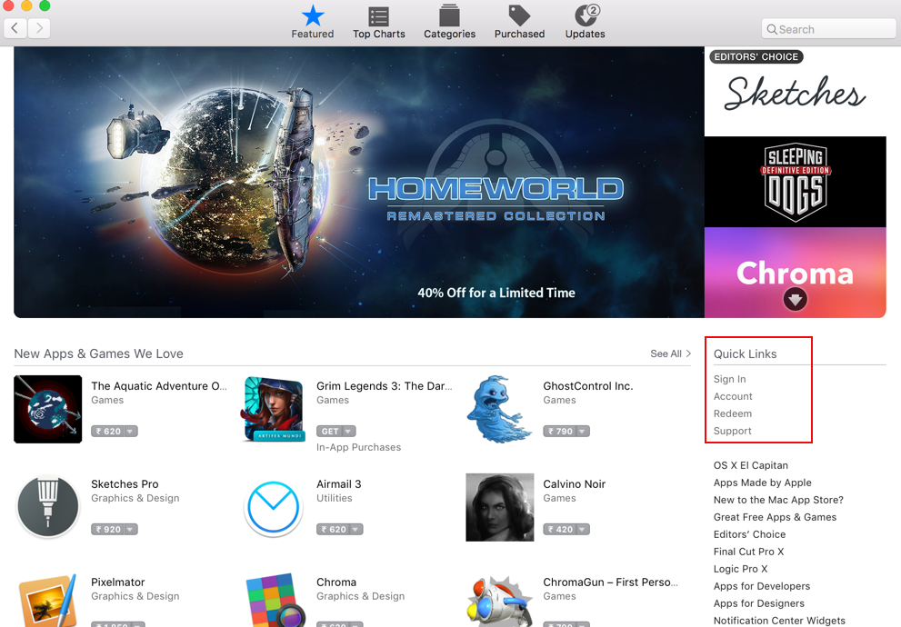
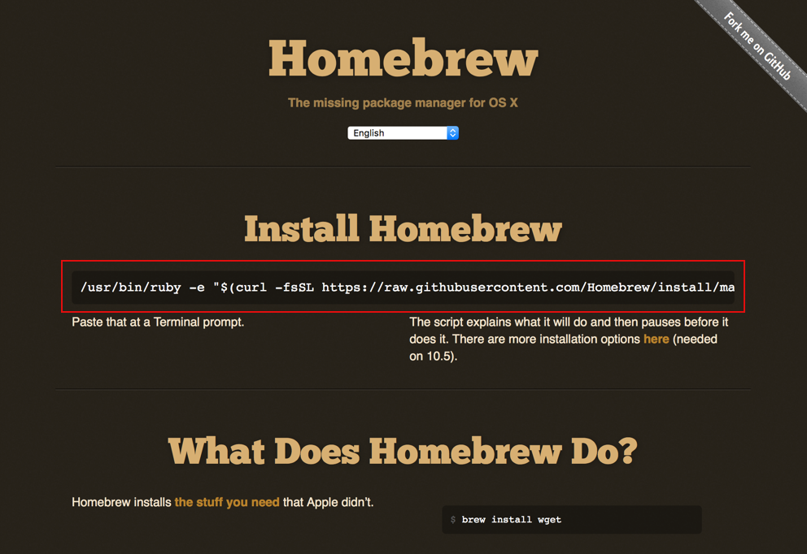
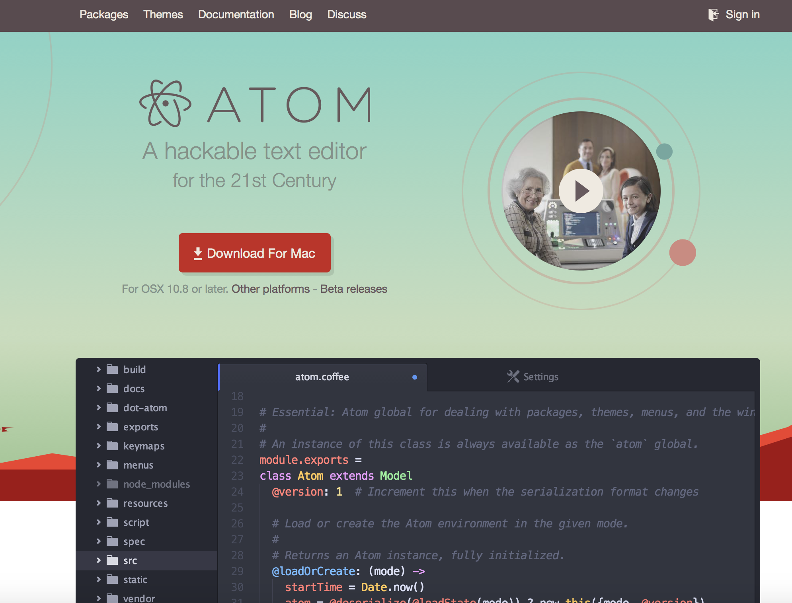

# System Setup
## 1. Setting up your Mac

#### Now that you have powered your Mac, and have it ON, let's take a look at how to set it up for working.  

#### Know your Mac hardware  

   * ##### Trackpad
       The trackpad in the Mac, is unique to Apple user experience and gives flawless pointing and selecting experience.
       * To select a file or an icon on screen, locate the arrow on the icon and press the trackpad once with single touch. (Important: Do not just touch or tap the surface of trackpad for selecting, press it in until you feel a click)
       * To get the "tap to click" option to be ON, go to "System Preference -> Trackpad -> select Tap to click"
       * To get more information about an icon, use two point(finger) touch on the trackpad and press it.
       * To move any icon from a location, select the icon and while still pressing down onto the trackpad surface move the finger to desired location on screen, and release. (Note: Same method can be used to select  a block of text)
       * To get the meaning of any word, you can select the word and press hard until you feel click twice. ( Note: this works on Macs with Force touch trackpads)
       * To get to the desktop screen, keep five fingers on the trackpad and move each finger away while still touching the surface of trackpad.
       * To get all the apps that are open on the screen, keep three or more fingers on trackpad and move them upward while still touching the surface of trackpad.

    For more information on all the trackpad gestures see [trackpad](https://support.apple.com/en-us/HT204895) and [force touch](https://support.apple.com/en-in/HT204352).

   * ##### Charging Point
     * The charging point is magnetic in the Mac, so when inserting the charger into the socket, do not push the pin. Just bring the pin near the socket.
     * To release the charger pin from the socket, do not pull the pin. Just hold the pin and break it upwards or downwards from the plane of keyboard, and pull it away.

   * ##### Switching OFF and Sleep mode
     * Macs are designed to work without a need to switch off each time a user's day of work is finished.
     * If you are leaving your Mac, unattended for an interval of few hours, you may have to put it in sleep mode rather than switching it off, so you can resume your work much faster.

   * ##### To find anything on your Mac, you can use spotlight search which can be opened by pressing `⌘ + space` keys.

#### Initially, you'll need an Apple ID  

  An Apple Id is necessary for day to day use of your Mac. For example, you need Apple ID to download apps from the App Store, books from the iBooks Store, sign apps in Xcode, etc.  

   * Open Safari (or any other web browser), and go to [Apple's Apple ID website](https://appleid.apple.com/account/home#!), and click on "Create Your Apple ID"(see below image).

     

   * Now, you can fill in the details, where in you have to specify your Solcen given official ID for email and verify it which would be your Apple ID

#### Setting up the App Store

   App Store is one of the place from where you can search and download supported apps that you will be using on your Mac. To use the App Store you will have to link it with your Apple ID.

   * To link your Apple ID, open the App Store app on your Mac, you can find it on the dock.
   * On the right side of the main page of App Store you can see "Quick Links", under which you can see "Sign In", click on it.(See the image for reference)

   

   * Once you have entered your Apple ID credential and clicked on sign in, App Store will prompt you to review your account if you have signed in for the first time.
   * Follow the steps to review, and when on Review Your Address page(see below image), make sure to click on NONE in the Payment Options. (If you do not get the NONE option, then create an [iCloud account](http://www.apple.com/in/icloud/setup/mac.html) which gives you @iCloud.com mail ID and repeat the [steps](#setting-up-the-app-store) using your iCloud ID)

   

## 2. Installing required apps  

#### Now, having set up with your Mac and linked Apple ID with App Store, you can download the apps that are required for working.

#### Xcode  

  Xcode is the main IDE you'll be using for developing apps and working with swift.

  * Open App Store and search for Xcode.
  * Once you find it, click get and install app.
  * Once Xcode is installed, open it and you'll see a launch screen.(see below image)

  

#### Homebrew  

   Homebrew is a package manager, which can be used to install many packages that are needed for work with ease. As the [Homebrew official website](http://brew.sh) says "_Homebrew installs the stuff you need that Apple didn't_".  

   * Open a web browser, and go to [Homebrew official website.](http://brew.sh) and copy the curl command.(see below image)

     

   * To install Homebrew, open terminal in your Mac.(You can use spotlight search or open it from the dock) and paste the copied curl command and hit `return` key.

   * To update any packages you've installed using `brew` command, you have to update Homebrew regularly.
   * To update Homebrew type in command `brew update` in the terminal and you'll get a list of all the packages that are to be updated, which includes packages you've installed with a tick beside it's name, now type in `brew upgrade` to confirm updating.

#### Atom

   Atom is a text editor with multiple capabilities. It can be used for editing text files, creating and editing markdown files with preview supported (For learning about markdown [click here](Introduction to Markdown.md)), for solving conflict in project files and many such purposes.  
   It supports various programming language color themes and auto-complete which is handy for coding.

   * To install Atom , open a web browser and go to [Atom official website.](https://atom.io) and download the file.

     

   * Open the downloaded file and installer should guide you to complete the installation.

#### Git  

   Git is a Distributed Version Control System(DVCS), which is used for storing, working, comparing and updating the files in the project you will be working on.  
   This is mainly for version control where we can update the code base and jump to new version, still holding to previous versions, on a centralized workstation, so many developers can work simultaneously on the same project without interference.

   * To learn about Git in detail and how to work with it, download the [ProGit ebook.](https://git-scm.com/book/en/v2)
   * To install Git, we use the brew package manager.
   * Open the terminal, and type in `brew install git` and hit the `return` key.  
   * You can confirm the installation by typing in the command `git version`, and it will show the version of Git installed.  

#### Cocoapods

  Cocoapods is a dependency manager for your Xcode project.  
  Cocoapods is used for installing and managing the required dependencies for the projects in Xcode, where a pod file will be created and the required dependency will be added to it with the supported version.

  * To install Cocoapods, open the terminal and run command `sudo gem install cocoapods` and hit `return` key.

#### SourceTree  

  SourceTree is an application that is used to ease the version control and Git communication for your project.
  SourceTree gives visual representation of branches, the commits, the files that are changed with the changes and line numbers, every detail for version controlling of the project.
  This enables a user to communicate to Git repository and make changes with absence of having to type commands on the terminal.

  * To install SourceTree, open a web browser and go to the [SourceTree official website](https://www.atlassian.com/software/sourcetree) and download the file.
  * Once downloaded, open the file and follow the steps to complete the installation.  

#### SwiftLint  

   SwiftLint is a tool to enforce the guidelines and conventions of Swift language. This tool can be used for checking if the code in your project meets with the style and conventions of the  Swift language as such running the command `swiftlint` on the terminal, will provide information regarding every error in each line of every file in the project.  

   * To install SwiftLint, open the terminal and run the command `brew install swiftlint`.   

#### Alcatraz

   Alcatraz is a package manager for Xcode, where in you can get to choose from various packages such as themes, tools, etc to ease the coding and usage on Xcode.  

   ***Please Note:*** _Coming Xcode 8, which has the option of System Integrity Protection(SIP) which has it's default value set to ON, therefore we cannot support working of Alcatraz in Xcode 8, unless we switch OFF the SIP option which is not recommended._

   * To install Alcatraz, open terminal and run this curl command: `curl -fsSL https://raw.githubusercontent.com/supermarin/Alcatraz/deploy/Scripts/install.sh | sh`.  
   * To learn more on how to use Alcatraz visit the [Alcatraz main website](http://alcatraz.io).
