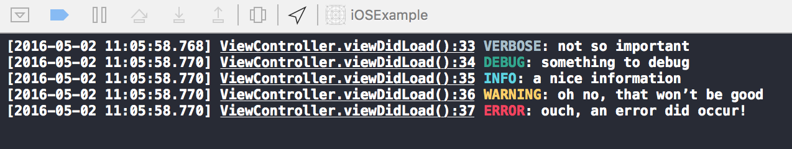

# Third party libraries

We have many third party libraries that we include in our project. These are explicitly included in the project so as to get some kind of added functionality and to ease the workability in coding.  

Few of them which are needed for many of our project are:

- RSBarcodes_Swift  
- SwiftyBeaver
- SnapKit  
- SwiftUtils  
- R.swift  
- Result

## RSBarcodes_Swift

This is a third party library that can be included in your project, if you have to deal with barcodes. This framework provides you the ability to scan various types of barcodes, and provides the string equivalent of the barcode. This barcode can be sent to the server in a request and you can fetch the data.

You can get the framework [from here](https://github.com/yeahdongcn/RSBarcodes_Swift#reader-1) and it includes the instruction of how to include it in your project.

This barcode detection and reading part can be implemented with AVMetadataOutput objects, where as this framework comes handy and is very helpful in the part where in you need the barcode image to be generated from the barcode string. This framework has the capability of generating the barcode image as in:

`let image = RSUnifiedCodeGenerator.shared.generateCode(barcodeString, machineReadableCodeObjectType: AVMetadataObjectTypeEAN13Code)`  

 Which would get the image of barcode in EAN13 format. The barcode can be generated for any given format that is supported by the framework.

## SwiftyBeaver

This framework gives logging feature to the swift project. Logging is very useful as in we can distinguish the various types of information that can be shown to the user, such as errors, debug information, warnings etc. Logging can be differentiated from the way we use print(), such that when you print() any information, it stays on the console and we may not get the timestamp in every interface. Where as in logging the information we can arrange it in different stacks of information, so as a programmer when you need any information regarding an event related to your app, you can just select the type and it would be arranged according to timestamp, so you can find it very quickly and can work on it.  

In SwiftyBeaver, we can log to the console and to a file. This is very helpful when you as a programmer are not in the vicinity of the app, and a user of your app has an error which they report to you. In this case, you can just tell them to forward the information in the log file so you can debug the cause for the error. More so, to further reduce the time to get to exact point where error occurred, you can tell the user to forward just the debug and error part of the log to you.

Since, you should be using Swift and Xcode, you would look forward to the color scheme the IDE provides. In SwiftyBeaver, we get the various types of logs in uniquely colored labels, as seen here:

  

You can get the SwiftyBeaver [from here](https://github.com/SwiftyBeaver/SwiftyBeaver) and it has the installation instructions. Please read through the [documentation](http://docs.swiftybeaver.com/article/7-introduction) of the SwiftyBeaver, to learn the need for logging and how to start logging to [Xcode console](http://docs.swiftybeaver.com/article/9-log-to-xcode-console) and to [a file](http://docs.swiftybeaver.com/article/10-log-to-file).  

(**IMPORTANT:** Coming the release of macOS(OS X Sierra) and iOS 10, Apple introduces the unified logging and activity tracing facility. This has the inbuilt logging facility in Swift and provides the user to log various types of information for the debugging purpose such as info, debug, error, fault and just log message as such. For further information watch the WWDC16 session on [Unified Logging and Activity Tracing](https://developer.apple.com/videos/play/wwdc2016/721/) and read through the corresponding [Apple documentation](https://developer.apple.com/reference/os/1891852-logging?language=objc). Also note that, this is an API which for now is supported in Objective-C. Swift integration is awaited. )

## SnapKit

As we can give the UIObjects, the constraints using the auto layout, there could be problems which could occur with mismatching constraints and hard to debug. To prevent the hard debugging process, we can give constraints through code, which would be clear and we can get the values of each constraint precisely.

This does have it's own problem if we need to debug, the code can get fiddly and most of the time, when we have more than 2 views the code can get very large and we can easily lose the flow of each line in the code. For example, if we have to create a view that fills it's superview leaving inset of 10 units on each side, we can implement in code as:

```swift
let superview = self;
let view1 = UIView() view1.setTranslatesAutoresizingMaskIntoConstraints(false) view1.backgroundColor = UIColor.greenColor() superview.addSubview(view1)
let padding = UIEdgeInsetsMake(10, 10, 10, 10)
superview.addConstraints([
  NSLayoutConstraint( item: view1, attribute: NSLayoutAttribute.Top, relatedBy: NSLayoutRelation.Equal, toItem: superview, attribute: NSLayoutAttribute.Top, multiplier: 1.0, constant: padding.top ),
  NSLayoutConstraint( item: view1, attribute: NSLayoutAttribute.Left, relatedBy: NSLayoutRelation.Equal, toItem: superview, attribute: NSLayoutAttribute.Left, multiplier: 1.0, constant: padding.left ),
  NSLayoutConstraint( item: view1, attribute: NSLayoutAttribute.Bottom, relatedBy: NSLayoutRelation.Equal, toItem: superview, attribute: NSLayoutAttribute.Bottom, multiplier: 1.0, constant: -padding.bottom ),
  NSLayoutConstraint( item: view1, attribute: NSLayoutAttribute.Right, relatedBy: NSLayoutRelation.Equal, toItem: superview, attribute: NSLayoutAttribute.Right, multiplier: 1.0, constant: -padding.right )
  ])
```

This is the code to create the view that fulfills the needs as per the above need, but this can get ugly and can increase by large amount for each added view. To prevent this we can use the SnapKit framework that provides us with much simpler and standard code:

```swift
let padding = UIEdgeInsetsMake(10, 10, 10, 10)
view1.snp_makeConstraints { (make) -> Void in
  make.edges.equalTo(superview).insets(padding)
}
```

if you want to specify each side for usabality, we can give:

```swift
view1.snp_makeConstraints { (make) -> Void in
  make.top.equalTo(superview.snp_top).offset(padding.top)
  make.left.equalTo(superview.snp_left).offset(padding.left)
  make.bottom.equalTo(superview.snp_bottom).offset(-padding.bottom)
  make.right.equalTo(superview.snp_right).offset(-padding.right)
}
```

Which is very simple, easy to understand and easy to debug.
To get SnapKit: [click here](https://github.com/SnapKit/SnapKit).
For the introduction and installation details: [click here](http://snapkit.io/docs/)  

## SwiftUtils

SwiftUtils is a collection of Swift utilities that are needed for app. The utilities make the coding easier by providing extended features to the data structures provided natively in Swift.

To get the SwiftUtils: [click here](https://github.com/surya-soft/SwiftUtils)  


## R.swift

When you provide string literals for identifiers for asset files and segues the identifier may be spelt wrong and this would not be seen as an error, nor would you get a warning from the compiler. This can only be noticed during the run time when the image goes missing from the view. To avoid this from happening, we can have the framework R.swift, which provides strong typed, autocompleted resources like images, fonts and segues for your Swift projects.

For example, if we have to give an identifier each for an image and a segue we give it like,

```swift
let image = UIImage(named: "mountain")
performSegueWithIdentifier("Scan Barcode", sender: nil)
```
This may have the identifier name to be wrongly set, this is avoided when R.swift is used as in,  

```swift
let image = R.image.mountain()
performSegueWithIdentifier(R.segue.overviewController.scanBarcode(), sender: self)
```

For more examples of R.swift: [click here](https://github.com/mac-cain13/R.swift/blob/master/Documentation/Examples.md)

To get R.swift: [click here](https://github.com/mac-cain13/R.swift). This has the installation instructions and documentation links provided within the readme file.


## Result

Result framework provides an alternative to the Swift's optional Success() and Failure(), in a single Result<Value, Error> which will have the value for Value if Success and Error if Failure.

To have the Result in the code  we can have it as:

```swift
typealias JSONObject = [String:AnyObject]

enum JSONError : ErrorType {
    case NoSuchKey(String)
    case TypeMismatch
}

func stringForKey(json: JSONObject, key: String) -> Result<String, JSONError> {
    guard let value = json[key] else {
        return .Failure(.NoSuchKey(key))
    }

    if let value = value as? String {
        return .Success(value)
    }
    else {
        return .Failure(.TypeMismatch)
    }
}
```
This will return a Result type which here either contains a String value if success, an Errortype if a failure occurred.

To handle a Result type of data, we can have a switch for handling each case, for the above snippet we can have:

```swift
switch stringForKey(json, key: "email") {

case let .Success(email):
    print("The email is \(email)")

case let .Failure(JSONError.NoSuchKey(key)):
    print("\(key) is not a valid key")

case .Failure(JSONError.TypeMismatch):
    print("Didn't have the right type")
}
```

To get the Result framework: [click here](https://github.com/antitypical/Result). This has the installation instructions.
