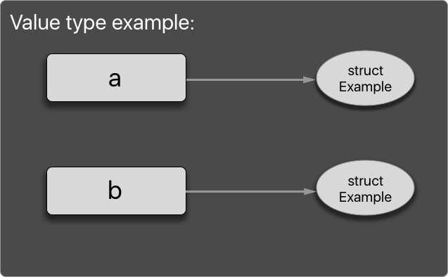
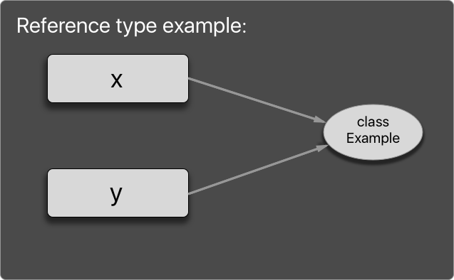

# Swift

Swift is a new programming language in development by Apple. It is framed upon the good parts of C and Objective-C, and maintains the readability of Objective-C, with access to existing Cocoa frameworks.  

Before jumping into Swift basics, we need the tools and should get familiar with using these for coding in Swift. Read through [this](../xcode/Xcode-documentation.md) for learning about Xcode.

## Introduction to Swift

Assuming that you have learnt the usage of the tools needed for coding, we can jump to basics of Swift and language conventions.

As said earlier, Swift is a new and in development language by Apple. The language is designed such that it is easy to read as code, and easy to learn from scratch.  

First of all, you'll need to download the Swift book and read through it for detailed understanding of each components of the language. You can get the book(The Swift Programming Language 3) from [iBooks store here](https://itunes.apple.com/in/book/swift-programming-language/id1002622538?mt=11) and also you can read it online on Apple developer website having [web version of the book](https://developer.apple.com/library/prerelease/content/documentation/Swift/Conceptual/Swift_Programming_Language/index.html#//apple_ref/doc/uid/TP40014097-CH3-ID0).

Let's get into basics of Swift. It's a fun programming language to learn, so it's mandatory that you to read through code snippets and try them on playground simultaneously.

As in any other language in Swift too, we can start by displaying "Hello world!", and it's as simple as that, just `print("Hello World!")` and you get the output. This line of code is a full program in Swift.


## Variables and constants  

To declare a variable use the keyword `var` before the identifier for the variable, such as `var a = 10`. This gives an identifier "a", an integer value of 10 initially, which can be changed further down the code.

To have a constant, which can be initialized just once and which will hold the value which will be immutable, we can declare it with a keyword `let`, such as ` let b = 10`. This will give the identifier "b" with an integer value of 10, which cannot be changed further down the code.

If you have already noticed, we don't need to always specify the datatype explicitly. Swift compiler has the capacity to infer the type of constant or variable when you assign a value to it, this is called *type inference*. If you want the identifier to be tied to a specific type, then you can explicitly specify it to be of that type by `var a: Int`, so now "a" can hold only Int values, where the compiler would show an error if given any other type of value.  

Note that, by now you would have noticed, there is a space in between each keyword and identifier. This is the Swift way of code, where you are expected to give a blank space between each identifier, keyword, and symbols. If not the compiler will show an error.  

## Coding style in Swift

* When coding in Swift, you should follow the Swift way of naming, usage of grammar and case conventions.  

* These are design guidelines that Apple has created, just so that when followed properly while coding, will result in very clear and readable code. For detailed explanation on these guidelines [click here](https://swift.org/documentation/api-design-guidelines/).  

## Comments

* To have a comment in the code block, write a comment by prefixing the line with `//` (two forward slashes). As `// This is a comment.` This is a one line comment.

* We can have multiple line comments which starts `/*` and ends with `*/`, as  

```swift
/* comment starts here       
this is the second line
this is the ending line*/
```

* The comments are useful for giving information about a method, a property in the code.

* The comments can be used for grouping methods in a file, for this we use the  `// MARK:` comments followed by the name for that section. Such as `// MARK: UITableView Methods`. The methods below these until the next `MARK:` comment will be grouped under this section.

* When coding, if you have a planned design and should make a note that you should be doing this further, you can create a `// TODO:` comment and continue to work on current code.
Such as `// TODO: Create a function to get the values`.  

## String

* `String` is a datatype in Swift that are Unicode compliant, so that any Unicode value can be used in Swift without error, as each character in Swift String is encoded as a unicode scalar which is a unique 21 bit number.

* To represent a String, you should put it between`""`(two double quotes). Such as `"This is a String"`, and you can assign an identifier with the value, `let string = "This is a String"`.  

* If a String value is assigned to be `""` then it is an empty String.

* You can concatenate two strings by using the concatenating operator, which is `+`, such as `var newString = string + " and this is second string"`, this will give `newString` a value of `This is a String and this is second string`.

* To have a value in the `print` statement, and to interpolate values into String we use the values inside the string literals by prefixing the literals with `\`. Which is  

```swift
  let numOfStates = 50  
  let country = "USA"  
  let interpolatedString = "The number of states in \(country) is \(numOfStates)."  
  print(interpolatedString)  
  // prints The number of states in USA is 50.
  ```  

## Optionals

Swift introduces another property, which is you can specify a variable to be an optional value.

An optional value is one which may or may not have a value, as it may have a `nil` value (which is to say value is missing) or it can have a readable value. This can be declared as `var a: Int?` which is to specify a "?" symbol beside the type, so initially this variable will have a `nil` value until any other value is assigned to it.  

We need optional values since, we can convert from one datatype to another, and this may fail to give a proper converted value, for instance if you have to convert from a `String` to an `Int` value, such as `String` value of `"123"` can be converted to `123` `Int` value, but `"abc"` cannot be converted.

## Value type and reference type

 * A value type is any type data that creates a copy of itself when called or assigned anywhere in the code. For example, structures are of value type in Swift, so when ever a struct is called or assigned it creates a copy of it. A reference type is any type of data that gives a reference of it's instance when it is called or assigned to a identifier or a function. This does not create a copy each time, thus this will save memory space when compared to value type. In Swift though, there are reasons to choose value type over reference type. Let's look at an example.  

```swift
// Value type example
struct Example {
  var data: Int = -1
}
var a = Example()
var b = a						// a is copied to b.
a.data = 22				  // Changes a, not b.
print("\(a.data), \(b.data)")	// prints "22, -1".  
```  

  

```swift
// Reference type example
class Example {
  var data: Int = -1
}
var x = Example()
var y = x						// x is copied to y.
x.data = 22					// changes the instance referred to by x and y.
print("\(x.data), \(y.data)")	// prints "22, 22".
```   

  

 * Well, having gone through the above definition of value types and reference type, you now know it's meaning on the surface, but in Swift this mechanism works very intelligently. In Swift, when we assign a value type to another identifier, the identifier will have reference to same address space as the initial source, until it is mutated. This is called as ___copy on write___ feature.  

 * The value type and reference type are further more linked to the `let` and `var`, as in for reference types, `let` means the reference must remain constant. In other words, you can’t change the instance the constant references, but you can mutate the instance itself. See this:

 ```swift
class Car {
    var wasWashed = false
}
let mercedes = Car()
let s350 = mercedes
s350.wasWashed = true
if mercedes.wasWashed {
    print("Mercedes cars were washed")
} else {
    print("Just the S350 was washed")
}
// prints Mercedes cars were washed
```
In the above reference example, though mercedes and s350 are declared as `let`, but still you can change the wasWashed property.  

 * For value types, `let` means the instance must remain constant. No properties of the instance will ever change, regardless whether the property is declared with `let` or `var`. Let's look at an example:  

 ```swift
 struct Dog {
     var wasFed = false
 }
 let labrador = Dog()
 let puppy = labrador
 labrador.wasFed = true // Cannot do this!
 puppy.wasFed = true // Cannot do this!
 ```  

 * Having gone through the details about value types and reference types, we now have to know when to choose what type. For deciding [read this](https://developer.apple.com/swift/blog/?id=10) on Apple's Swift blog.

 * For detailed view on value and reference type in Swift, make sure you read through this very [informative post](https://medium.com/capital-one-developers/reference-and-value-types-in-swift-de792db330b2#.obt5dbk7y).

 * You can read the [Raywenderlich](https://www.raywenderlich.com)'s article on same topic having [part1](https://www.raywenderlich.com/112027/reference-value-types-in-swift-part-1) and [part2](https://www.raywenderlich.com/112029/reference-value-types-in-swift-part-2).

## Switch statement

 * In Swift switch cases have to be exhaustive. Which is to say that, the switch should consist of all possible cases that the value can take.

 * If you cannot explicitly handle every case for some reason, only then should the `default:` case be given as a last resort.

 * More so, in Swift if the switch case is handling a value, having 'n' cases, then compiler gives the error is every case is not handled explicitly.  

## SwiftLint

 * SwiftLint is a package that let's you see every mistake in your code regarding the Swift style and conventions. The followed SwiftLint rules you have to abide with when coding are given in [this book](Swiftlint.md). Read through them to improve your code design.

## Pattern Matching

Swift provides extensive pattern matching for comparing, type casting, and many such purposes. Patterns are just structures, which consist of values which can be matched with other values.
More so, patterns are rules, on which values are matched against.

For example, for checking if an Int value is an even number, we can give it in `if` condition with a function as:

```swift
func isEven(number: Int) -> Bool {  
  return number % 2 == 0  
}   

if isEven(2) {  
    print("The number is an even number")  
    // Do something        
} else {  
    print("The number is an odd number")  
    // Do something  
}
```

In the `isEven()` above, the rule which is the pattern is that `number % 2` and value is `0` and it is checking if it is equatable. The function having a return type of `Bool`, will return `true` or `false`, based on the pattern matching result. This is taken to the overloaded operator function of `~=` for equatable types.

Similarly, we have pattern to match any value in the range of values in `for` loop. Such as  

```swift
for _ in 1...3 {      
    // Do something  
}
```   

Which will do something in the loop for three times, without regard to the range value of the iteration. This pattern `_`(underscore) is called a "Wildcard Pattern", and it matches any value.

Note that in any `for` loop, we can specify `prefixValue..postfixValue`(two `.`'s) for matching the range to include prefixed value as starting of range and loop till one value less that postfixed value. To include both the prefix and postfix value, specify `prefixValue...postfixValue`(three `.`'s).  

Similarly, for tuple values, you can have a pattern matching it for same number of values in that tuple. Such as `(1,2)` can be matched by tuple of `(x,y)`, where x represents 1 and y represents 2. This can be implemented in `for` and `Array` as   

```swift
let tuples = [(1,2), (3,4), (5,6)]
for (x, y) in tuples {
// Do something with x
// Do something with y
}
```
