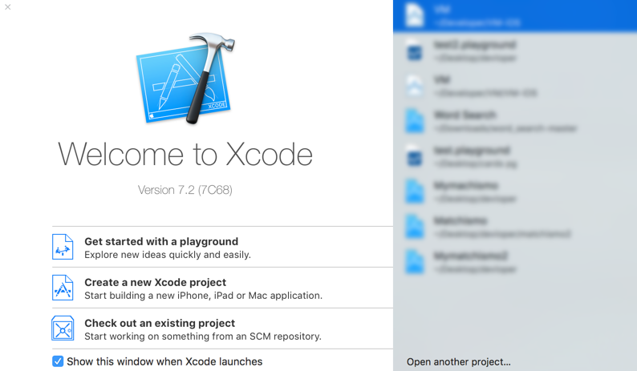
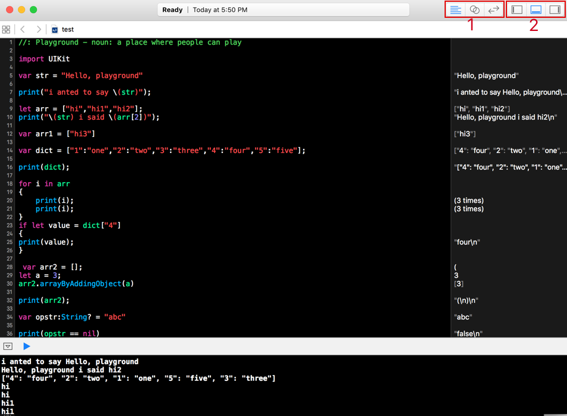
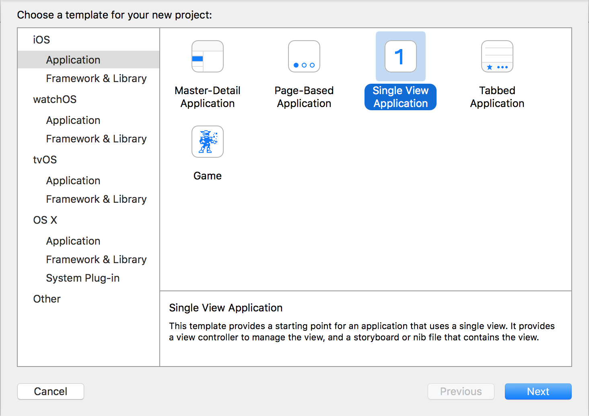
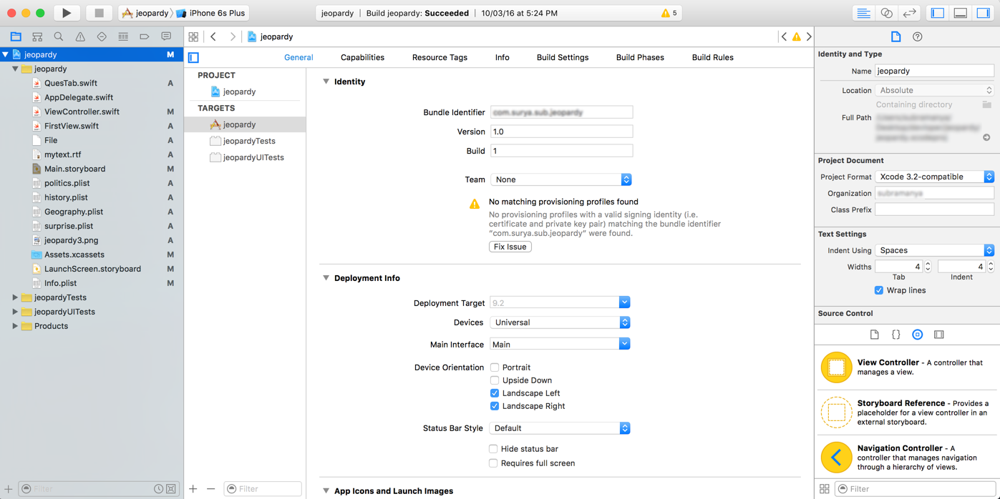

## Xcode

Xcode is the primary IDE you'll be using to code using Swift and for development of apps.
To get started with Xcode, open it and you'll see the launch screen as seen in below image.

Xcode gives you three options to choose from the left panel:

 * **Get started with a playground**:

 Playground is part of Xcode, where you can type in a snippet of code and it gives you the output immediately.
 So, as a programmer playground is very helpful when experimenting with code design, as we can see all possible outcomes and can test for edge cases if any before incorporating it in main project.(Playground: see below image)

 

 As you can see in the above image, a playground screen consist of mainly three parts:

  * An area where you can type in code, which will compile the code and show the representation for each line just on the right panel.

  * Top toolbar which has a activity viewer which provides the date when last modified of the file, and the running/ready status for the code compilation.

  * The toolbar also houses, two set of buttons on the right side. These buttons can be grouped as in the image above as 1 and 2.

  * The button set 1, has editor selectors which are *standard editor*, *assistant editor*(for comparing/retrieving two code bases) and *version editor*(from left to right).

  * The button set 2, has panel selectors, which are (from left to right) *the navigator* (which shows every file with directories), *the debug area* (seen in the image below) which can be used for debugging the code and to view the console output, and *the utilities panel* (which gives information about file and components which can be used for editing).

  For detailed tips on usage of playground visit [Apple's playground documentation page](https://developer.apple.com/library/ios/recipes/Playground_Help/Chapters/AboutPlaygrounds.html#//apple_ref/doc/uid/TP40015166-CH28-SW1).

  The code on Xcode can be further dug deep to get the details of each identifier or function by pressing on the name of the identifier or function holding down the option key.

  This can be confirmed when you hover over the name holding down the option key, the cursor icon will change to a question mark symbol(?), and then you can click to get details in a pop up.

* **Create a new Xcode project**

 This let's you create a new project from scratch. Once you click on this you'll be shown a pop up prompting you to select from various OS on which you can create an app, and type of file.(see below image)

 

 The type of application you want to start with by default will be Single View Application, and each type when selected will give it's details at the bottom.

 Once you select the type of application you want to develop, you'll be shown another pop up, where in you'll be prompted to enter the details of the app, as it's name, the organization's name and such details which can be edited.

 Once you have completed entering details you'll be in the main view of the Xcode where you can start with your project.(see below image)

 

 The Xcode main view is similar to playground interface, but much more detailed.

 There's similar toolbar on the top, which houses the same set of buttons on the right which provides the same functionality as in playground. In Xcode the toolbar has added feature on the left side, where it provides (from left to right) a run button, a stop button, and simulator selector for the active project.

 To run the code we can press the run button which builds the project code base and installs it onto the selected simulator or any device if connected.

 The navigator pane on the left side, provides the view of every file in the project which can be selected and edited.

 The central area is the editor pane on which we can edit the details of the project and type the code when appropriate files are selected in the navigator.

 The right pane is utility pane which gives editable components of the project and add ons to the project files.

 For detailed information about Xcode visit [Apple's developer documentation](https://developer.apple.com/library/ios/referencelibrary/GettingStarted/DevelopiOSAppsSwift/Lesson2.html#//apple_ref/doc/uid/TP40015214-CH5-SW1).

* **Check out an existing project**

 This gives the option to select a project from a repository if any has been cloned onto the system, if not we can enter the path to that repository and check that project on Xcode.

The right pane on the screen shows the most recently opened project in that order including the playground files.
